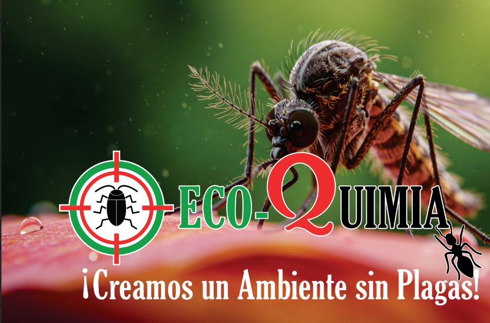

# Ecoquimia

Sitio web oficial de **Ecoquimia**, empresa dominicana especializada en control de plagas, sanitización y soluciones preventivas para hogares y negocios.

[](https://astro.build/)
[](https://tailwindcss.com/)
[](https://www.typescriptlang.org/)
[](https://vercel.com/)

🌐 **Producción:** [fumigadoraecoquimia.com.do](https://fumigadoraecoquimia.com.do)



## Descripción

La plataforma presenta los servicios de Ecoquimia, facilita el contacto mediante WhatsApp y permite solicitar cotizaciones desde un formulario web. También ofrece contenido educativo sobre las plagas más comunes en República Dominicana.

El proyecto está desarrollado con Astro en modo SSR y desplegado en Vercel. Su estructura prioriza rendimiento, accesibilidad, SEO, diseño adaptable a dispositivos móviles y facilidad de mantenimiento.

## Funcionalidades principales

- Catálogo de servicios de control de plagas y sanitización.
- Formulario de cotización con envío de correos mediante Resend.
- CAPTCHA, honeypot y validaciones para reducir solicitudes automatizadas.
- Acceso directo a WhatsApp con mensajes predefinidos.
- Contenido educativo sobre cucarachas, roedores, termitas y otras plagas.
- Diseño responsive para computadoras, tabletas y móviles.
- Sitemap, metadatos y redirecciones orientadas a SEO.
- Página de políticas y manejo de rutas no encontradas.
- Redirección de dominios alternativos hacia el dominio oficial.

## Tecnologías

| Área                 | Tecnología              |
| -------------------- | ----------------------- |
| Framework            | Astro 5                 |
| Estilos              | Tailwind CSS 3          |
| Lenguaje             | TypeScript / JavaScript |
| Validación           | Zod y HTML Validate     |
| Correo transaccional | Resend                  |
| Iconos               | Lucide Astro            |
| Despliegue           | Vercel                  |
| SEO                  | Astro Sitemap           |

## Requisitos

- [Node.js 22](https://nodejs.org/)
- npm
- Una cuenta de Resend para probar el envío real de cotizaciones

## Instalación local

```bash
git clone https://github.com/melvin01RD/ecoquimia-astro-site.git
cd ecoquimia-astro-site
npm install
```

Crea un archivo `.env` en la raíz del proyecto:

```env
PUBLIC_SITE_URL=http://localhost:4321
PUBLIC_SITE_ORIGIN=http://localhost:4321

RESEND_API_KEY=re_xxxxxxxxxxxxxxxxx
RESEND_FROM_EMAIL="Ecoquimia <cotizaciones@tu-dominio.com>"
RESEND_TO_EMAIL=correo-destino@ejemplo.com
```

> [!IMPORTANT]
> No publiques credenciales reales en GitHub. Configura las variables de producción directamente en Vercel.

Inicia el servidor de desarrollo:

```bash
npm run dev
```

El sitio estará disponible en `http://localhost:4321`.

## Comandos disponibles

| Comando                | Descripción                                          |
| ---------------------- | ---------------------------------------------------- |
| `npm run dev`          | Inicia el entorno local de desarrollo.               |
| `npm run build`        | Genera el build de producción.                       |
| `npm run preview`      | Ejecuta una vista previa del build.                  |
| `npm run check`        | Ejecuta Astro Check, build y validación del HTML.    |
| `npm run check:astro`  | Valida componentes Astro y TypeScript.               |
| `npm run lint:html`    | Construye el proyecto y valida el HTML generado.     |
| `npm run format`       | Formatea el código con Prettier.                     |
| `npm run format:check` | Comprueba el formato sin modificar archivos.         |
| `npm run clean`        | Elimina los directorios generados `dist` y `.astro`. |
| `npm run deploy`       | Valida y despliega el sitio a producción en Vercel.  |

## Estructura del proyecto

```text
src/
├── components/       # Header, footer, tarjetas y elementos reutilizables
├── config/           # Datos oficiales y configuración del negocio
├── content/plagas/   # Contenido educativo en Markdown
├── data/             # Servicios y categorías
├── layouts/          # Layout base del sitio
├── lib/              # Integraciones, como el cliente de correo
├── pages/             # Páginas, rutas y endpoints de API
└── styles/            # Estilos globales y específicos

public/                # Imágenes, iconos y archivos públicos
astro.config.mjs       # Configuración principal de Astro
vercel.json            # Redirecciones de dominios en Vercel
```

## Validación antes de publicar

Antes de crear un pull request o desplegar una versión, ejecuta:

```bash
npm run format:check
npm run check
```

También se recomienda comprobar manualmente:

- Navegación mediante teclado y estados de foco.
- Menú móvil y desplazamiento vertical.
- Formulario de cotización con datos válidos e inválidos.
- Recepción del correo y funcionamiento de `reply-to`.
- Enlaces de teléfono y WhatsApp.
- Visualización en tamaños móvil, tableta y escritorio.
- Ausencia de errores en la consola y solicitudes fallidas en Network.

## Despliegue

El proyecto usa el adaptador oficial de Vercel y se ejecuta en modo SSR (`output: "server"`). Los endpoints ubicados en `src/pages/api/` requieren el runtime de Node.js.

Para desplegar desde la terminal:

```bash
npm run deploy
```

El script ejecuta primero todas las validaciones definidas en `npm run check` y luego publica la versión en producción.

## Contacto

- Sitio web: [fumigadoraecoquimia.com.do](https://fumigadoraecoquimia.com.do)
- Teléfono y WhatsApp: [809-777-7586](https://wa.me/18097777586)
- Correo comercial: [areacomercial.eco@gmail.com](mailto:areacomercial.eco@gmail.com)
- Ubicación: Santo Domingo, República Dominicana

## Autor y mantenimiento

Proyecto desarrollado y mantenido por [Melvin De La Cruz](https://github.com/melvin01RD) con contribuciones de [Cesar](https://github.com/NIGTHGIT).

---

© Ecoquimia. Todos los derechos reservados.
